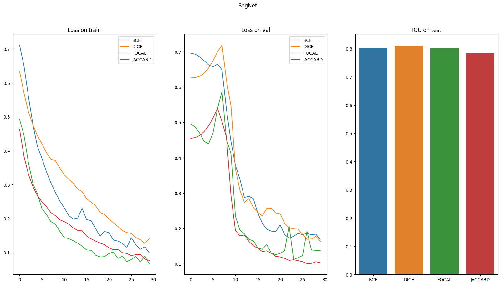
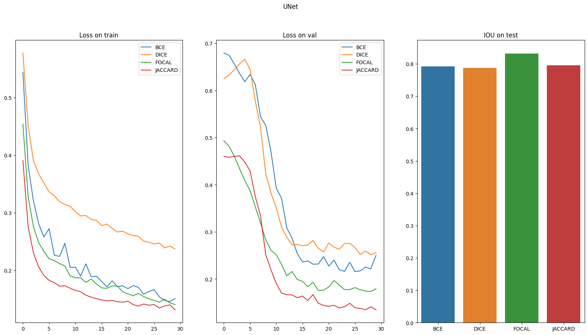
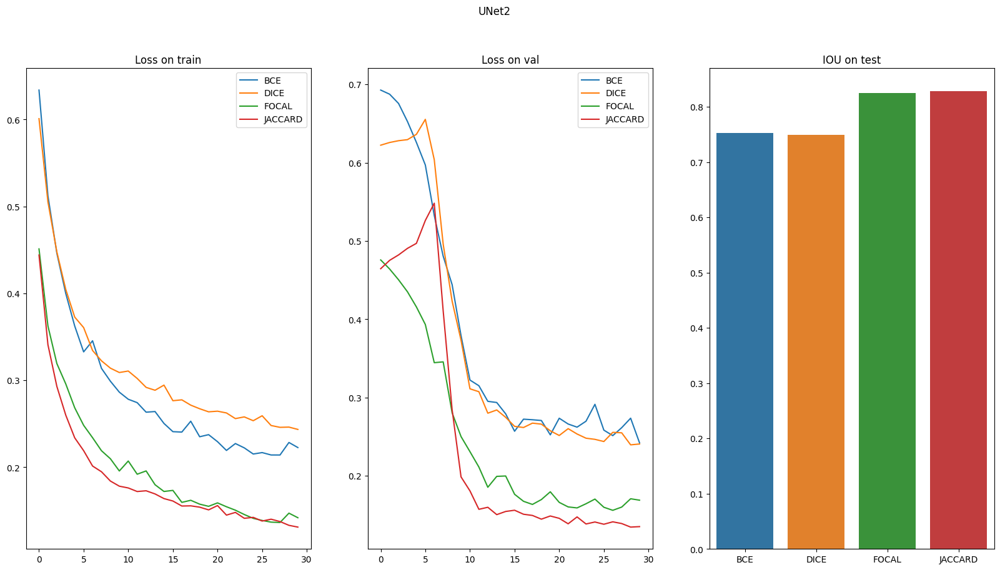

# Medicine_segm
Решена задача по сегментации медицинских снимков. Были написаны и сопоставлены между собой различные архитектуры (SegNet, UNet и UNet2) и функционалы потерь(BCE, Dice, Focal, Jaccard), был написан отчёт по выполнению и результатам работы.

